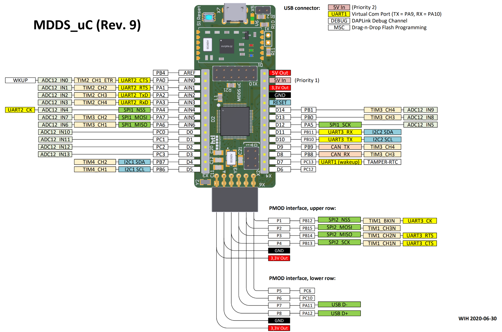

# Nuva

[Projektübersicht Datei](https://docs.google.com/document/d/1YYM-Z9wTVEQmF1ao4a_qM2Ej833VAJdgFoP2_Sf8HwA/edit?usp=sharing)

---

## Nützliche Websiten
https://room-15.github.io/blog/2015/03/26/esp8266-at-command-reference/
https://arduino-esp8266.readthedocs.io/en/latest/

---


> ## Planungen...
> D0 - 14 <br> => C0 - C3, B7, B6, C12, C13, B8, B9, B10, B11, A5, B0, B1
> AIN0 - AIN6 => A0 - A6
>
> RESET <br>
> P1 - P8 <br>
> AI

<br>

| Pattern       | Klasse / Struktur                | Rolle                                                         |
| ------------- | -------------------------------- | ------------------------------------------------------------- |
| **Model**     | `SensorData`, `Cortex_STM32F103` | Hält aktuelle Daten (Temp, Hum, Time) – zentrale Datenhaltung |
| **Singleton** | (optional `UartReceiver`)        | Für UART-Kommunikation (falls nur eine Instanz)               |
| **Observer**  | z. B. `DisplayManager`           | Reagiert auf neue Daten (`update()`-Call)                     |
| **Strategy**  | (später für Anzeige-Modi etc.)   | Für verschiedene Anzeige-/Logik-Strategien                    |

<br>

```txt
┌─────────────────────┐
│   UartReceiver      │  ◄─ Singleton (liest UART)
└─────────┬───────────┘
          │
          │ notify()
          ▼
┌─────────────────────┐
│  Cortex_STM32F103   │  ◄─ Model (hält SensorData)
└─────────┬───────────┘
          │
          │ update()
          ▼
┌─────────────────────┐
│   DisplayManager    │  ◄─ Observer (zeigt Daten an)
└─────────────────────┘
```

---

## UART2



---
# Zeit

> ### Uhrzeit abrufen
> ### ``AT+CIPSNTPTIME?``


> ## Zeitzone konfigurieren (Österreich / Vienna)
>> ### Befehl Aufbau
>> ``AT+CIPSNTPCFG=<enable>,<timezone>,<NTP_server>`` 
>
>> ### Sommerzeit
>> ``AT+CIPSNTPCFG=1,2,"pool.ntp.org"``
> 
>> ### Winterzeit
>> ``AT+CIPSNTPCFG=1,1,"pool.ntp.org"``

---
# Wetter

Generiere einen API-Key auf [WeatherAPI](https://www.weatherapi.com/) (kostenlos).

> definiere den Host und den Pfad für die API-Anfrage im C++ Code:
> ```cpp 
> const char* host = "api.weatherapi.com";
> const char* path = "/v1/current.json?key=DEIN_KEY&q=Retz&aqi=no";
> ```

> TCP-Verbindung aufbauen:
> ```cpp
> "AT+CIPSTART=\"TCP\",\"api.weatherapi.com\",80\r\n"
> ```

> CIPSEND senden:
> ```cpp
> "AT+CIPSEND=[LENGTH]\r\n"
> ```

> HTTP-Anfrage:
> ```cpp
> "GET [PATH] HTTP/1.1\r\n"
> "Host: [HOST]\r\n"
> "Connection: close\r\n"
> "\r\n"
> ```

---

```json
{
  "location": {
    "name": "Retz",
    "region": "Niederosterreich",
    "country": "Austria",
    "lat": 48.75,
    "lon": 15.95,
    "tz_id": "Europe/Vienna",
    "localtime_epoch": 1751294586,
    "localtime": "2025-06-30 16:43"
  },
  "current": {
    "last_updated_epoch": 1751293800,
    "last_updated": "2025-06-30 16:30",
    "temp_c": 26.2,
    "temp_f": 79.2,
    "is_day": 1,
    "condition": {
      "text": "Sunny",
      "icon": "//cdn.weatherapi.com/weather/64x64/day/113.png",
      "code": 1000
    },
    "wind_mph": 13.2,
    "wind_kph": 21.2,
    "wind_degree": 351,
    "wind_dir": "N",
    "pressure_mb": 1020.0,
    "pressure_in": 30.12,
    "precip_mm": 0.0,
    "precip_in": 0.0,
    "humidity": 23,
    "cloud": 0,
    "feelslike_c": 25.4,
    "feelslike_f": 77.7,
    "windchill_c": 27.3,
    "windchill_f": 81.2,
    "heatindex_c": 26.3,
    "heatindex_f": 79.3,
    "dewpoint_c": 7.6,
    "dewpoint_f": 45.7,
    "vis_km": 10.0,
    "vis_miles": 6.0,
    "uv": 4.9,
    "gust_mph": 16.7,
    "gust_kph": 26.9
  }
}
```


