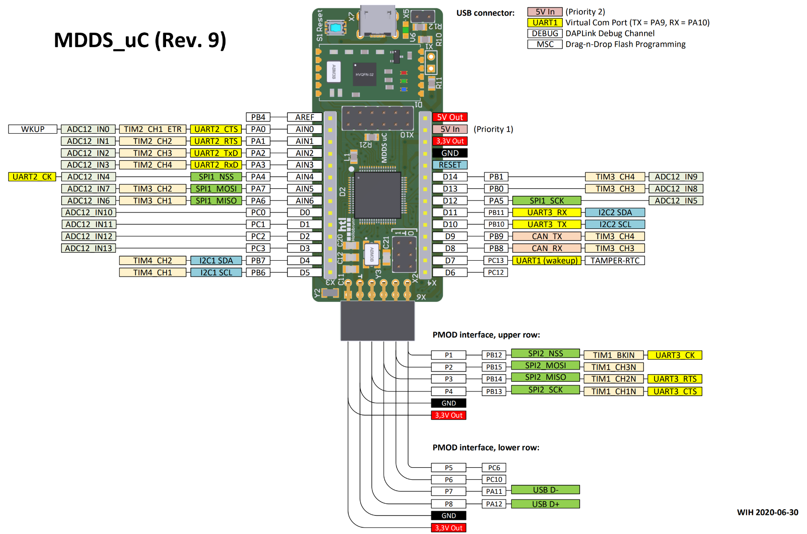

D0 - 14   => C0 - C3, B7, B6, C12, C13, B8, B9, B10, B11, A5, B0, B1
AIN0 - AIN6 => A0 - A6

RESET  
P1 - P8  

AI

| Pattern       | Klasse / Struktur                | Rolle                                                         |
| ------------- | -------------------------------- | ------------------------------------------------------------- |
| **Model**     | `SensorData`, `Cortex_STM32F103` | Hält aktuelle Daten (Temp, Hum, Time) – zentrale Datenhaltung |
| **Singleton** | (optional `UartReceiver`)        | Für UART-Kommunikation (falls nur eine Instanz)               |
| **Observer**  | z. B. `DisplayManager`           | Reagiert auf neue Daten (`update()`-Call)                     |
| **Strategy**  | (später für Anzeige-Modi etc.)   | Für verschiedene Anzeige-/Logik-Strategien                    |

+---------------------+
|  UartReceiver       |  <- Singleton, liest UART
+---------------------+
|
v  notify()
+---------------------+
| Cortex_STM32F103    |  <- hält SensorData (Model)
+---------------------+
|
v
+---------------------+
| DisplayManager      |  <- Observer, zeigt an
+---------------------+

## UART2

